# Introdução ao Docker

Primeira etapa do trabalho da disciplina de **Redes e Administração de Sistemas** do Curso Técnico em Informática Integrado ao Ensino Médio do IFSP, campus Campos do Jordão.

O objetivo foi instalar o Docker em uma máquina virtual com Ubuntu Server, escrever uma aplicação web em **Python** com o framework **Flask** e executá-la dentro de um **container**, acessando a página pelo navegador.

- **Ambiente:** Ubuntu Server sobre Oracle VirtualBox
- **Imagem base:** `python:3.14-slim`

---

## Sumário

1. [O que é Docker](#1-o-que-é-docker)
2. [Preparação da máquina virtual](#2-preparação-da-máquina-virtual)
3. [Instalação do Docker](#3-instalação-do-docker)
4. [Validação com hello-world](#4-validação-com-hello-world)
5. [Estrutura do projeto](#5-estrutura-do-projeto)
6. [A aplicação Flask](#6-a-aplicação-flask)
7. [O Dockerfile](#7-o-dockerfile)
8. [Construção da imagem](#8-construção-da-imagem)
9. [Execução do container](#9-execução-do-container)
10. [Testes de acesso](#10-testes-de-acesso)
11. [Evolução da aplicação](#11-evolução-da-aplicação)
12. [Comandos úteis](#12-comandos-úteis)
13. [Problemas encontrados](#13-problemas-encontrados)

---

## 1. O que é Docker

Docker é uma plataforma de código aberto que empacota uma aplicação junto de todas as suas dependências em uma unidade isolada e portável, chamada **container**.

A diferença para uma máquina virtual é o nível em que a virtualização acontece: a máquina virtual virtualiza o **hardware**, enquanto o container virtualiza o **sistema operacional**.

| Container | Máquina virtual |
|---|---|
| Compartilha o kernel do host | Tem kernel próprio |
| Leve, na casa dos MB | Pesada, na casa dos GB |
| Inicia em segundos | Inicia em minutos |
| Isolamento em nível de processo | Isolamento completo |

Três conceitos que não podem ser confundidos:

- **Imagem:** template imutável com a aplicação e suas dependências. Não executa sozinha.
- **Container:** instância em execução de uma imagem.
- **Dockerfile:** arquivo de texto com as instruções para construir uma imagem.

A arquitetura tem três peças: o **cliente** (o comando `docker` que você digita), o **daemon** (o processo que de fato faz o trabalho) e o **registry** (o repositório de imagens, sendo o Docker Hub o público padrão).

---

## 2. Preparação da máquina virtual

A máquina virtual roda **Ubuntu Server** no VirtualBox. Dois ajustes foram necessários.

**Rede.** O adaptador ficou em **NAT** o tempo todo, que basta para a VM alcançar a internet. Em NAT a VM fica numa rede privada do VirtualBox (o `ip a` mostra `10.0.2.15` na interface `enp0s3`) e o Windows não alcança esse endereço. Para resolver, foram criadas duas regras de **redirecionamento de portas** em Configurações → Rede → Avançado → Redirecionamento de Portas:

| Regra | Porta do host | Porta da VM | Para quê |
|---|---|---|---|
| SSH | 2222 | 22 | acesso remoto ao terminal |
| Flask | 5000 | 5000 | acesso à aplicação web |

Com isso, `localhost:2222` no Windows chega na porta 22 da VM, e `localhost:5000` chega na 5000.

**Acesso remoto por SSH.** Com a regra acima, a conexão a partir do terminal do Windows fica:

```bash
ssh aluno@localhost -p 2222
```

O destino é `localhost`, o próprio Windows, e não o IP da VM, porque quem atende a porta 2222 é o VirtualBox, que repassa a conexão. Isso resolve o problema de não conseguir colar código dentro da janela do VirtualBox.


**Repositórios antigos.** A imagem da VM disponibilizada no laboratório já trazia arquivos de repositório desatualizados, que precisam ser removidos antes de instalar pela fonte oficial:

```bash
sudo rm /etc/apt/sources.list.d/docker.list
sudo rm /etc/apt/sources.list.d/docker.sources
sudo apt-get update
```

---

## 3. Instalação do Docker

Seguindo a [documentação oficial](https://docs.docker.com/engine/install/ubuntu/), na modalidade de instalação a partir do repositório. Depois de configurar a chave GPG e adicionar o repositório:

```bash
sudo apt-get install docker-ce docker-ce-cli containerd.io \
     docker-buildx-plugin docker-compose-plugin
```

Saída:

```
The following NEW packages will be installed:
  containerd.io docker-buildx-plugin docker-ce docker-ce-cli
  docker-ce-rootless-extras docker-compose-plugin pigz
0 upgraded, 7 newly installed, 0 to remove and 5 not upgraded.
Need to get 99.8 MB of archives.
After this operation, 382 MB of additional disk space will be used.
```

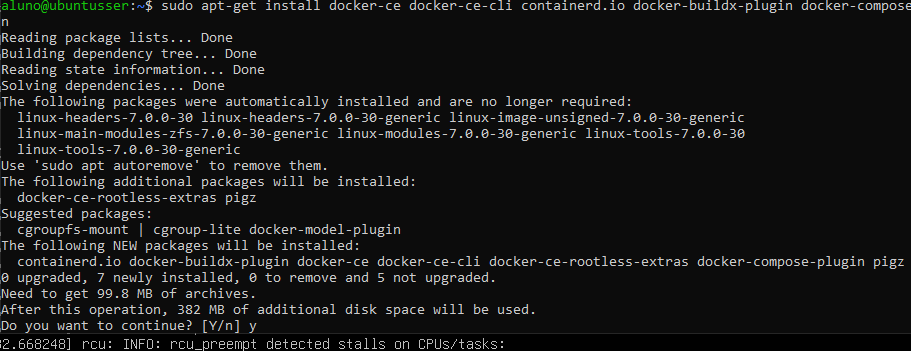

Foram 7 pacotes e cerca de **382 MB** adicionais em disco.

> Os comandos do Docker precisam de `sudo`, ou o usuário precisa estar no grupo `docker`:
> ```bash
> sudo usermod -aG docker $USER
> ```
> É preciso sair e entrar de novo na sessão para o grupo valer.

---

## 4. Validação com hello-world

```bash
docker --version
```

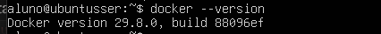

Isso confirma só o cliente. Para verificar que o daemon também está de pé e consegue criar containers:

```bash
sudo docker run hello-world
```

Saída:

```
Unable to find image 'hello-world:latest' locally
latest: Pulling from library/hello-world
4f55086f7dd0: Pull complete
d5e71e642bf5: Download complete
Digest: sha256:5dd0d3e6e255913fc30f90b9f2b1d359cc2cbdb48090cc4b65f1676e203243cc
Status: Downloaded newer image for hello-world:latest

Hello from Docker!
This message shows that your installation appears to be working correctly.

To generate this message, Docker took the following steps:
 1. The Docker client contacted the Docker daemon.
 2. The Docker daemon pulled the "hello-world" image from the Docker Hub.
 3. The Docker daemon created a new container from that image which runs the
    executable that produces the output you are currently reading.
 4. The Docker daemon streamed that output to the Docker client, which sent it
    to your terminal.
```

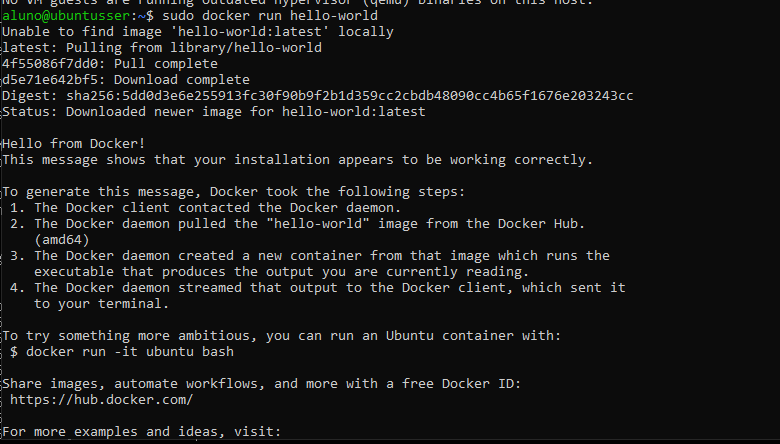

Essa saída descreve exatamente a arquitetura da seção 1: o cliente falou com o daemon, o daemon buscou a imagem no Docker Hub porque ela não existia localmente, criou o container e devolveu a saída ao terminal.

---

## 5. Estrutura do projeto

```bash
tree projeto-flask
```

```
projeto-flask
├── app
│   ├── app.py
│   └── requirements.txt
└── Dockerfile

2 directories, 3 files
```

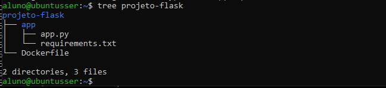

Manter o código dentro de `app/` não é só organização. Isso permite copiar **primeiro** o `requirements.txt` para a imagem e só **depois** o código, o que aproveita muito melhor o cache de camadas do Docker.

Em seguida, a imagem base foi baixada:

```bash
docker pull python:3.14-slim
```

```
3.14-slim: Pulling from library/python
3d2c3ff37d4c: Pull complete
d4a378e57055: Pull complete
6310eb16bf42: Pull complete
6bd54ebeb5af: Pull complete
194f274eb493: Download complete
d58edce158f3: Download complete
Digest: sha256:cad9a2c871761c413caa6fdd6441c783451e740a48aaeba60ae62a8b53525ef6
Status: Downloaded newer image for python:3.14-slim
```

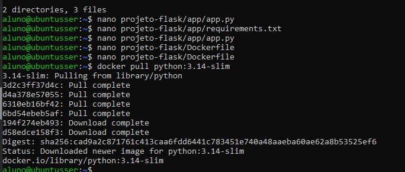

A variante `slim` traz só o necessário para rodar Python, seguindo a boa prática de construir imagens leves.

Estado do repositório local nesse ponto:

```bash
docker image ls
```

```
IMAGE                ID             DISK USAGE   CONTENT SIZE   EXTRA
hello-world:latest   5dd0d3e6e255       25.9kB         9.49kB   U
python:3.14-slim     cad9a2c87176        191MB         48.6MB
```

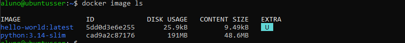

---

## 6. A aplicação Flask

`app/app.py`, primeira versão:

```python
from flask import Flask

app = Flask(__name__)

@app.route('/')
def home():
    return """
    <h1>Minha primeira aplicação Flask</h1>
    <p>Aplicação executada dentro de um container Docker!</p>
    """

if __name__ == '__main__':
    app.run(host='0.0.0.0', port=5000)
```

Dois detalhes são decisivos para funcionar dentro de um container:

- **`host='0.0.0.0'`** faz o servidor aceitar conexões de qualquer interface de rede. Com o padrão `127.0.0.1`, a aplicação só responderia a requisições vindas de dentro do próprio container e o mapeamento de portas não teria efeito nenhum.
- **A porta 5000** precisa ser a mesma no `EXPOSE` do Dockerfile e no `-p` do `docker run`.

`app/requirements.txt`:

```
flask
```

---

## 7. O Dockerfile

```dockerfile
FROM python:3.14-slim

WORKDIR /app

COPY app/requirements.txt .
RUN pip install --no-cache-dir -r requirements.txt

COPY app/ .

EXPOSE 5000

CMD ["python", "app.py"]
```

O que cada instrução faz:

| Instrução | Função |
|---|---|
| `FROM` | define a imagem base |
| `WORKDIR` | define o diretório de trabalho dentro da imagem |
| `COPY` | copia arquivos do host para a imagem |
| `RUN` | executa comandos durante a construção |
| `EXPOSE` | documenta a porta em que a aplicação escuta |
| `CMD` | comando executado quando o container inicia |

**Por que copiar o `requirements.txt` antes do código?** Cada instrução gera uma camada. Como as dependências mudam muito menos que o código, deixá-las em uma camada anterior faz com que alterar o `app.py` não obrigue a reinstalar o Flask a cada build. O `--no-cache-dir` do pip evita gravar arquivos temporários na camada, deixando a imagem menor.

---

## 8. Construção da imagem

```bash
docker build -t minha-flask .
```

Saída:

```
[+] Building 9.3s (10/10) FINISHED                            docker:default
 => [internal] load build definition from Dockerfile                    0.0s
 => => transferring dockerfile: 208B                                    0.0s
 => [internal] load metadata for docker.io/library/python:3.14-slim     0.0s
 => [internal] load .dockerignore                                       0.0s
 => => transferring context: 2B                                         0.0s
 => [1/5] FROM docker.io/library/python:3.14-slim@sha256:cad9a2c8...    0.1s
 => [internal] load build context                                       0.0s
 => => transferring context: 407B                                       0.0s
 => [2/5] WORKDIR /app                                                  0.0s
 => [3/5] COPY app/requirements.txt .                                   0.0s
 => [4/5] RUN pip install --no-cache-dir -r requirements.txt            7.9s
 => [5/5] COPY app/ .                                                   0.0s
 => exporting to image                                                  1.0s
 => => exporting layers                                                 0.6s
 => naming to docker.io/library/minha-flask:latest                      0.0s
 => => unpacking to docker.io/library/minha-flask:latest                0.3s
```

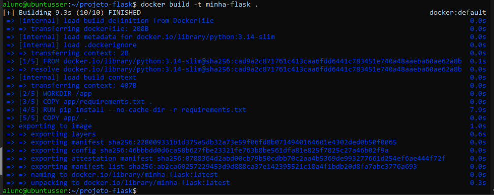

O `-t` dá um nome à imagem e o ponto final indica o **contexto de construção**, ou seja, o diretório cujo conteúdo é enviado ao daemon.

A construção levou **9,3 segundos** e percorreu 10 etapas, das quais as 5 numeradas correspondem às instruções do Dockerfile. A mais demorada foi a instalação do Flask pelo pip, com **7,9 segundos**, que é justamente o motivo de isolá-la em uma camada própria.

---

## 9. Execução do container

```bash
docker run -d -p 5000:5000 --name meu-flask minha-flask
docker ps
```

```
ca0fc1323196e98dc2806548255e90b2d9c84b1578671363e9a9f4577cd10ece

CONTAINER ID   IMAGE         COMMAND           CREATED          STATUS
ca0fc1323196   minha-flask   "python app.py"   24 seconds ago   Up 23 seconds

PORTS                                         NAMES
0.0.0.0:5000->5000/tcp, [::]:5000->5000/tcp   meu-flask
```

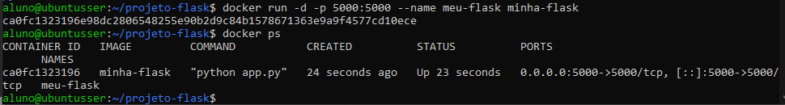

| Opção | Função |
|---|---|
| `-d` | executa em segundo plano (detached) |
| `-p 5000:5000` | mapeia a porta do host para a porta do container |
| `--name` | dá um nome legível ao container |

O `docker ps` mostra o container com status `Up` e o mapeamento `0.0.0.0:5000->5000/tcp` ativo.

Imagens locais depois do build:

```bash
docker image ls
```

```
IMAGE                ID             DISK USAGE   CONTENT SIZE   EXTRA
hello-world:latest   5dd0d3e6e255       25.9kB         9.49kB   U
minha-flask:latest   ab2ca6025722        211MB         51.8MB
python:3.14-slim     cad9a2c87176        191MB         48.6MB
```

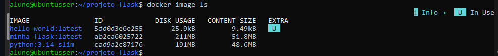

Como o container roda em segundo plano, a saída dele não aparece no terminal. Para ver o que a aplicação registrou:

```bash
docker logs meu-flask
```

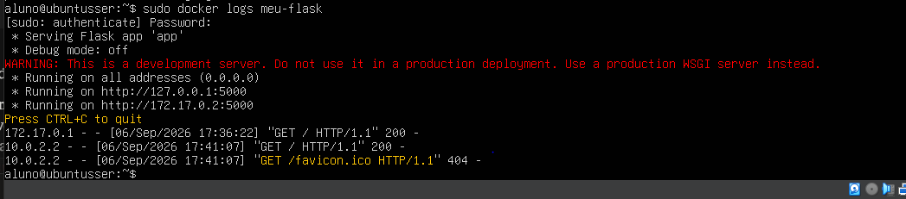

A saída mostra o Flask escutando em `0.0.0.0` e registra a origem de cada requisição, o que deixa as duas camadas de rede visíveis: `172.17.0.1` é o `curl` de dentro da VM, `10.0.2.2` é o navegador do Windows chegando pela NAT do VirtualBox.

A `minha-flask` aparece com 211 MB contra 191 MB da imagem base, mas o espaço realmente ocupado a mais é de apenas **20 MB**. Todas as camadas herdadas do Python são compartilhadas fisicamente entre as duas imagens. Esse é o efeito do sistema de camadas.

---

## 10. Testes de acesso

**Dentro da VM, pelo terminal:**

```bash
curl http://localhost:5000
```

```html
    <h1>Minha primeira aplicação Flask</h1>
    <p>Aplicação executada dentro de um container Docker!</p>
```

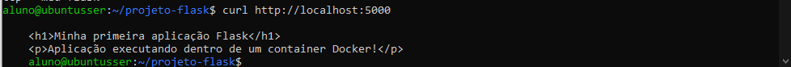

**No navegador do Windows,** em `http://localhost:5000`, graças à regra de redirecionamento:


---

## 11. Evolução da aplicação

Com o fluxo funcionando, a aplicação ganhou as rotas `/sobre` e `/contato`, um menu de navegação compartilhado entre as páginas e uma folha de estilos CSS com tema escuro. O código completo está em [`app/app.py`](app/app.py).

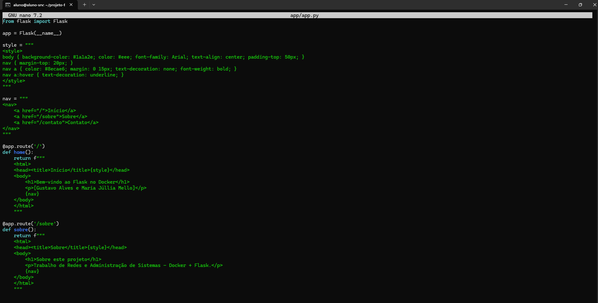

A edição foi feita com o `nano`, direto na máquina virtual:

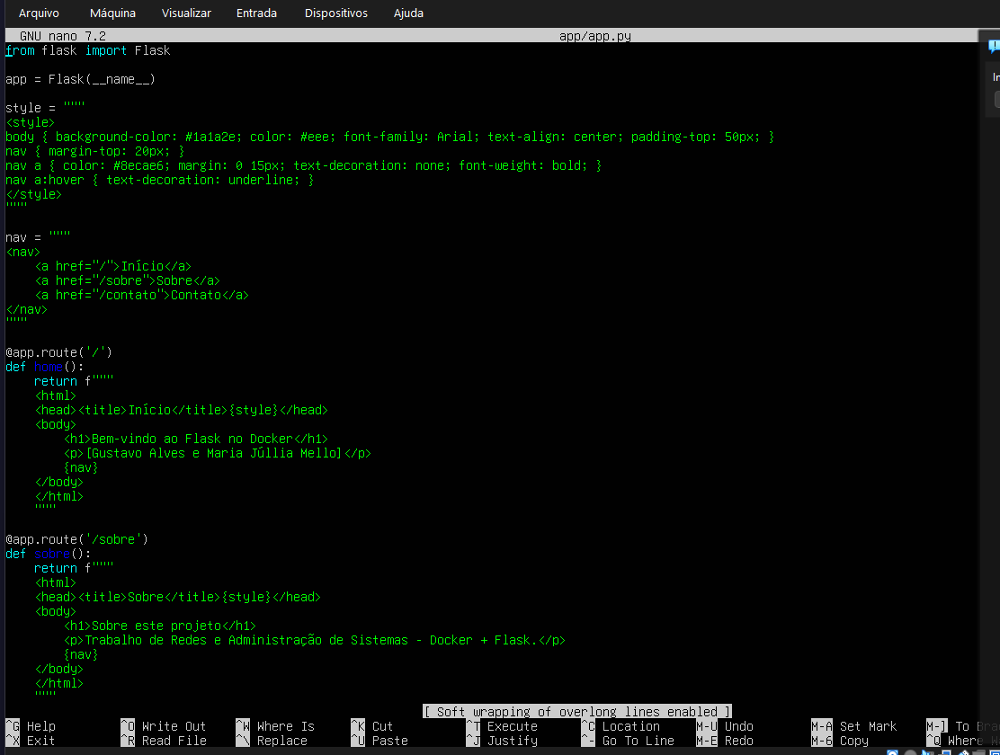

Estrutura adotada: `style` e `nav` ficam em variáveis no topo do arquivo e são interpoladas em cada rota com f-string, evitando repetir o mesmo HTML três vezes.

```python
nav = """
<nav>
    <a href="/">Início</a>
    <a href="/sobre">Sobre</a>
    <a href="/contato">Contato</a>
</nav>
"""

@app.route('/sobre')
def sobre():
    return f"""
    <html>
    <head><title>Sobre</title>{style}</head>
    <body>
        <h1>Sobre este projeto</h1>
        <p>Trabalho de Redes e Administração de Sistemas - Docker + Flask.</p>
        {nav}
    </body>
    </html>
    """
```

Como o código está **dentro da imagem**, editar o arquivo não muda o container que já está rodando. É preciso refazer o ciclo:

```bash
docker stop meu-flask
docker rm meu-flask
docker build -t minha-flask .
docker run -d -p 5000:5000 --name meu-flask minha-flask
```

Esse segundo build foi bem mais rápido, porque só a camada do `COPY app/ .` precisou ser refeita. Todas as anteriores vieram do cache, incluindo a instalação do Flask.

Resultado:

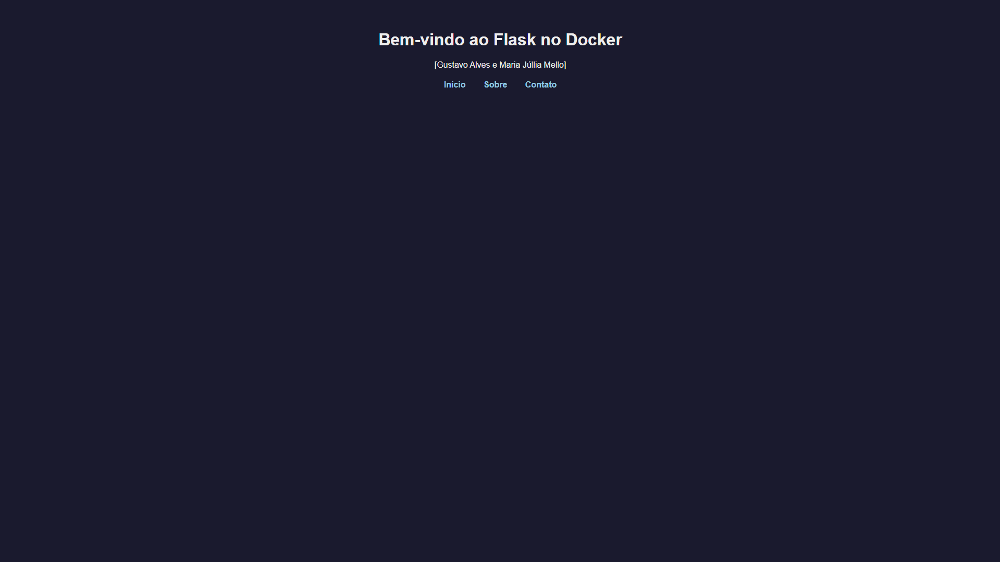

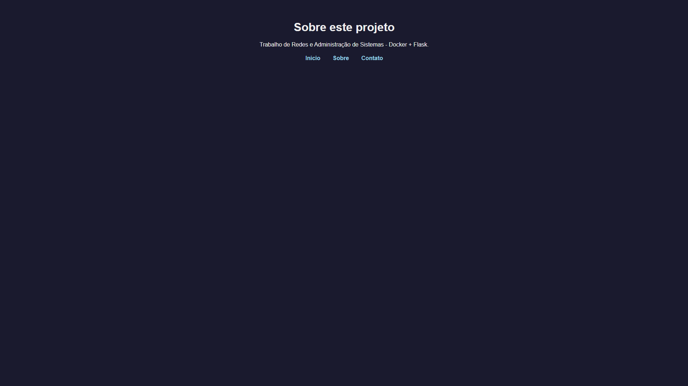

As três páginas ficaram acessíveis pelo menu, o que mostra que o roteamento do Flask funciona normalmente dentro do container e que uma única porta mapeada basta para servir a aplicação inteira.

---

## 12. Comandos úteis

```bash
docker --version                  # versão instalada
docker ps                         # containers em execução
docker ps -a                      # todos os containers
docker image ls                   # imagens locais
docker logs meu-flask             # logs do container
docker stop meu-flask             # para o container
docker rm meu-flask               # remove o container
docker rmi minha-flask            # remove a imagem
docker exec -it meu-flask bash    # abre um shell dentro do container
```

---

## 13. Problemas encontrados

**A página não abre no navegador do hospedeiro.**
Em NAT a VM alcança a internet, mas o Windows não alcança a VM. O container subia normal, o `docker ps` mostrava `Up` e o `curl` interno respondia, mas o navegador não abria nada. O engano foi procurar o problema no Docker: o `-p 5000:5000` funcionava, o que faltava era a camada de fora, entre Windows e VM. A solução foi o **redirecionamento de portas** no VirtualBox. Trocar para Bridge também resolveria, mas depende da rede do laboratório e o IP muda a cada sessão.

O `docker logs meu-flask` deixa as duas camadas visíveis: requisições de `172.17.0.1` são o `curl` de dentro da VM, vindas do gateway da `docker0`; requisições de `10.0.2.2` são o navegador do Windows, vindas do gateway da NAT do VirtualBox.

**Não dá para colar código dentro da VM.**
O Ubuntu Server não tem interface gráfica e a janela do VirtualBox não compartilha a área de transferência com o Windows. Digitar o `app.py` inteiro no `nano`, com CSS e três rotas, é lento e cheio de erro de digitação. Acessar a VM por um terminal no próprio Windows resolve, porque aí o copiar e colar funciona.

**Editei o app.py mas a página não mudou.**
O código foi copiado para dentro da imagem no `docker build`. O container em execução continua servindo a versão antiga. É preciso parar, remover, reconstruir e executar de novo.

**O `apt-get update` acusa conflito de repositórios.**
Sobraram arquivos antigos em `/etc/apt/sources.list.d`. Remover `docker.list` e `docker.sources` resolve.

**O container está `Up` mas nada responde na porta 5000.**
O Flask estava escutando só em `127.0.0.1`. É preciso declarar `app.run(host='0.0.0.0', port=5000)`.

**`permission denied` ao rodar o docker.**
Usar `sudo` ou adicionar o usuário ao grupo `docker` e reiniciar a sessão.

---

## Como reproduzir

```bash
git clone https://github.com/mjuspy/introducao-ao-docker.git
cd introducao-ao-docker
docker build -t minha-flask .
docker run -d -p 5000:5000 --name meu-flask minha-flask
```

Depois é só abrir `http://localhost:5000`.

---

## Referências

- [Documentação oficial do Docker](https://docs.docker.com)
- [Instalação do Docker Engine no Ubuntu](https://docs.docker.com/engine/install/ubuntu/)
- [Docker Hub](https://hub.docker.com)
- [Documentação do Flask](https://flask.palletsprojects.com)
- VITALINO, J. F. N.; CASTRO, M. A. N. *Descomplicando o Docker*. Rio de Janeiro: Brasport, 2016.
